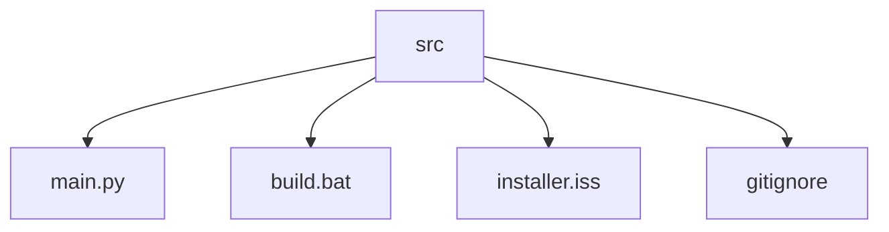

# Whiteboard: A Digital Drawing Application

## 🗂️ Description

The Whiteboard project is a digital drawing application that provides a graphical user interface (GUI) for users to create, edit, and manipulate visual content. This application is designed for individuals who need a simple and intuitive tool for drawing, annotating, and saving images. The Whiteboard application allows users to draw shapes, text, and lines, select and manipulate objects, pick colors, use an eraser, and save the canvas as an image.

The application is built using Python and leverages the Tkinter library for creating the GUI, along with PIL for image processing. The project aims to provide a straightforward and efficient digital whiteboard experience.

## ✨ Key Features

### 🎨 Drawing and Editing

* Draw shapes, lines, and text on a canvas
* Select and manipulate objects (e.g., move, resize)
* Change colors using a color picker
* Use an eraser to remove content

### 📸 Image Management

* Save the canvas as an image file

### 🖌️ User Interface

* Intuitive GUI with a simple layout
* Interactive tools for drawing and editing

## 🗂️ Folder Structure

## 🛠️ Tech Stack

## ⚙️ Setup Instructions

To run the Whiteboard application locally:

* Clone the repository: `git clone https://github.com/KnoxCodes/Whiteboard.git`
* Navigate to the project directory: `cd Whiteboard`
* Install required packages: 
  * Make sure you have Python installed on your system.
  * Install required Python packages using pip: `pip install pillow`
* Run the application: 
  * Execute the main application file using Python: `python main.py`

To build and install the application:

* Run the build script: `build.bat`
* Follow the installation prompts to install the application.

## 📝 GitHub Actions

No GitHub Actions are currently configured for this repository.

## 📁 Files and Directories

The following files and directories are present in the project:

* `.gitignore`: specifies files and directories to ignore in the Git repository
* `installer.iss`: Inno Setup script for creating an installer
* `build.bat`: batch script for automating the build process
* `main.py`: main application file for the Whiteboard project

  

<h3>Knox</h3>

No information provided.

 

  <a href="https://gitfull.vercel.app">Made by GitFull</a>

    
